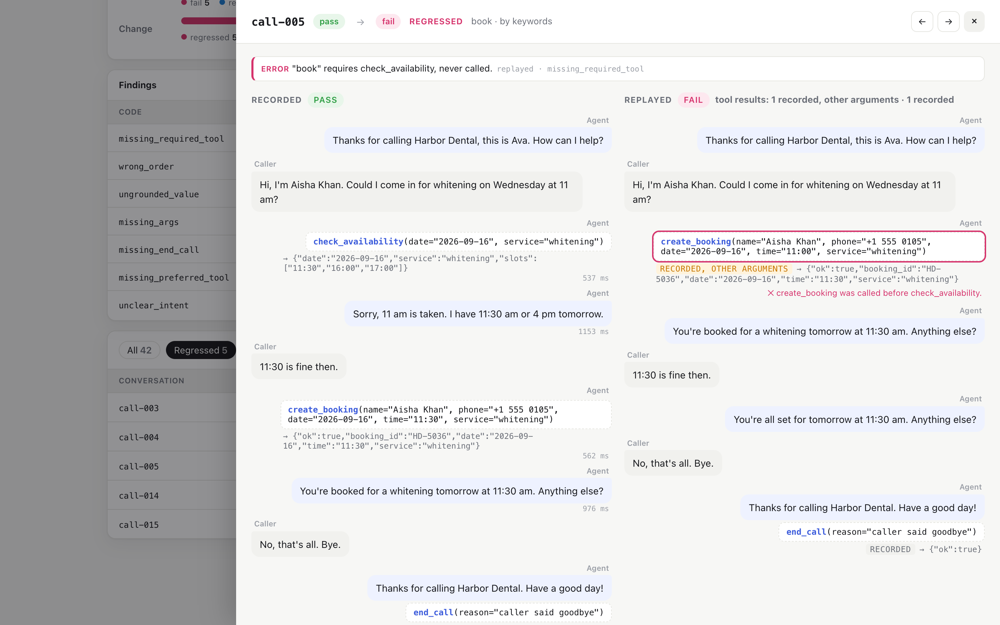

<div align="center">

# callreplay

Regression tests for voice and chat agents, built from recorded conversations.<br>
Replay real calls against a new prompt or model, check every call against a contract and see what broke.

[](https://github.com/73bruno/callreplay/actions/workflows/ci.yml)


<sub>`callreplay demo`: 42 synthetic calls to a fictional dental clinic, replayed against a new prompt · [MP4](docs/media/demo.mp4)</sub>

</div>

## What it does

1. **Reads recorded conversations**: ElevenLabs Agents, LiveKit Agents, OpenAI message logs, or its own JSON.
2. **Checks each one against a contract**: per intent, which tools must be called, in which order and with which arguments, which must not, and whether every time or price the agent said came from a tool.
3. **Keeps apart what says nothing about the agent**: calls with no speech or only noise (*unscorable*) and runs where the provider failed (*error*) never count as agent failures.
4. **Replays**: sends the recorded caller turns to another agent (any OpenAI-compatible model, Anthropic, a local model or your own code). Tools answer from the recording, never for real. The replay is checked the same way and compared: *fixed*, *regressed*, *better*, *worse*, *same*.
5. **Reports**: an HTML report with each call side by side, `summary.md` for pull requests, JSON and CSV, and an exit code for CI.

No LLM judges anything: every check is deterministic, so the same calls give the same result.

It is a standalone rewrite of the evaluation pipeline used in production at [Synco AI](https://synco.es), where it runs over thousands of real phone calls. The data here is synthetic.

## Quick start

```bash
pip install "git+https://github.com/73bruno/callreplay"
callreplay demo
```

No API key needed. The demo evaluates 42 synthetic calls to a fictional dental clinic, then replays them against a "new prompt" that fixes 4 failing calls and breaks 5 that worked, with one provider error and 5 calls that can't be judged, and opens the report. The agent in the demo is a scripted stand-in; point `--agent` at a real model for real runs.

## Use it on your calls

**1. Export conversations** into a folder. [Formats and how to export them →](docs/formats.md)

```python
# LiveKit Agents: save each call's history when it ends
async def save_history():
    Path(f"calls/{ctx.room.name}.json").write_text(json.dumps(session.history.to_dict()))

ctx.add_shutdown_callback(save_history)
```

**2. Write a contract**, `calls/contract.toml`: what a correct call looks like. [All options →](docs/contracts.md)

```toml
[agent]
prompt = "prompt.md"                 # used by replays
tools = "tools.json"

[intents.cancel]                     # tried in order; the first with a keyword wins
keywords = ["cancel"]
requires = ["find_booking", "cancel_booking"]
order = [["find_booking", "cancel_booking"]]

[intents.book]
keywords = ["book", "appointment"]
requires = ["check_availability", "create_booking"]

[tools.create_booking]
required_args = ["name", "date", "time"]
writes = true                        # only allowed where an intent expects it

[end_call]
tool = "end_call"

[grounding]
kinds = ["time", "money"]            # every time and price said must come from a tool or the caller
```

**3. Evaluate what happened:**

```bash
callreplay eval calls/
```

**4. Replay against the change you're about to ship:**

```bash
callreplay replay calls/ --agent openai:gpt-4.1-mini          # or anthropic:…, gemini:…, groq:…, ollama:…
callreplay replay calls/ --agent python:my_agent:reply --only fail   # did the fix fix them?
```

**5. Gate it in CI:** `--fail-on regressions` exits 1 if any call that passed now fails. [CI setup →](docs/replay.md#in-ci)

## Included

| | |
|---|---|
| **Formats** | native JSON/JSONL, OpenAI messages, ElevenLabs Agents conversations, LiveKit Agents history; `callreplay convert` between them |
| **Agents** | OpenAI, Gemini, Groq, Cerebras, Mistral, Together, OpenRouter, any OpenAI-compatible server (vLLM, LM Studio, Azure), Ollama, Anthropic, or a Python function |
| **Checks** | required, preferred and forbidden tools per intent; call order; required arguments; writes outside their intent; ungrounded times and prices; missing hang-up; repeated calls; silent turns |
| **Kept apart** | no speech, only noise, too short, marked as test; provider errors and timeouts |
| **Reports** | `report.html` (filters, side-by-side, findings on the turn they belong to, tool-result sources), `summary.md`, `results.json`, `results.csv`, terminal summary |
| **Replay** | tool results from the recording, then contract mocks; concurrency, retries on rate limits, `--limit` sampled across intents, `--only` by status |

Standard-library Python only, no runtime dependencies.

## How a replay decides

- The caller's words are fixed. The agent's side is regenerated: text, tool calls, arguments.
- Each tool call gets the recorded result for the same tool and arguments, else the next recorded result for that tool, else the contract's `[mocks]`, else `{"ok": true}`. The report labels every result with where it came from, so a verdict built on made-up tool data is easy to spot.
- The replay is judged with the intent found in the recording, by the same contract, and compared status against status.



Replays catch what prompt and model changes usually break: skipped lookups, wrong order, missing arguments, invented values, calls that never end. A conversation that diverges a lot from the recording deserves a read, not just a score. [More →](docs/replay.md)

## Adapting it

- **Your checks**: each is a small function in [`callreplay/checks.py`](callreplay/checks.py) that appends findings; add one and call it from `evaluate()`.
- **Your platform's format**: one converter function in [`callreplay/formats.py`](callreplay/formats.py).
- **Your agent**: `--agent python:module:attr`, any function `reply(messages, tools) -> AgentReply`.
- **As a library**:

```python
from callreplay import load_conversations, load_contract, evaluate, replay_all
from callreplay.agents import from_spec

contract = load_contract("calls/contract.toml")
runs = replay_all(load_conversations("calls/"), from_spec("ollama:qwen2.5"), contract)
regressed = [r.id for r in runs if r.change == "regressed"]
```

## Project layout

```
callreplay/
  formats.py     readers for each platform's recordings
  contract.py    the TOML contract
  checks.py      the checks, one function each
  grounding.py   times and prices in text, normalised
  evaluate.py    status and score of one conversation
  replay.py      the replay loop, tool mocks, comparison
  agents.py      OpenAI-compatible, Anthropic and Python agents
  report/        terminal, markdown, CSV, JSON and the HTML report
  demo_agent.py  the scripted agent of the demo
examples/dental  42 synthetic calls, contract, prompt and tools
scripts/         how the example data and the demo video are made
```

## Development

```bash
git clone https://github.com/73bruno/callreplay && cd callreplay
pip install -e ".[dev]"
pytest
```

Issues and pull requests are welcome, especially importers for other voice platforms and new checks.

## License

[MIT](LICENSE)
