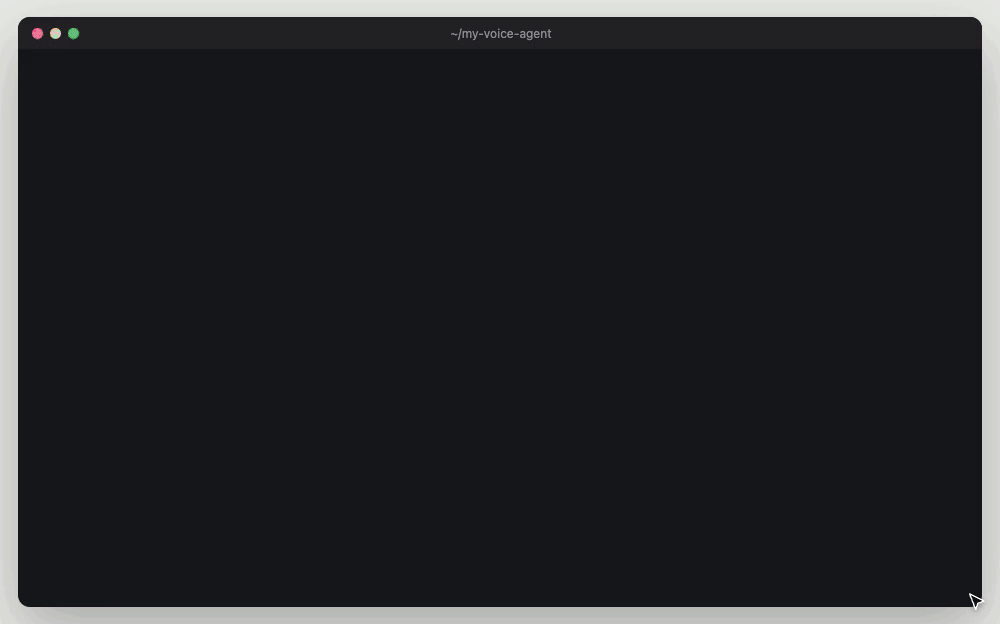
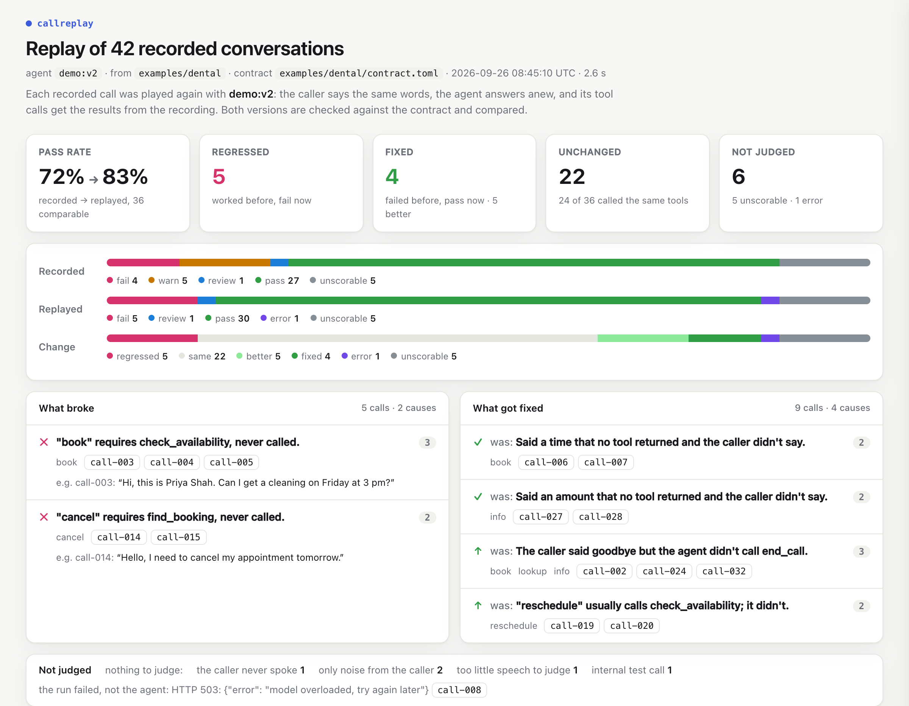
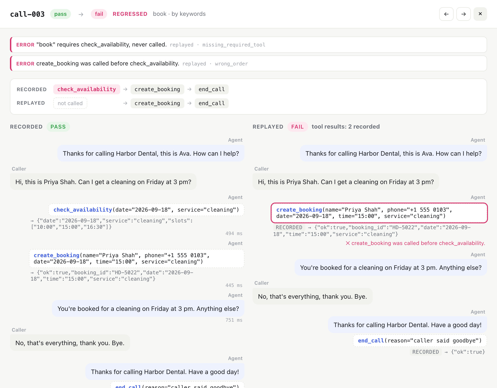

<div align="center">

# callreplay

**Regression tests for voice and chat agents, built from your recorded calls.**<br>
Change the prompt or the model, replay real calls against it, and see which calls broke, which got fixed, and why.

[](https://github.com/73bruno/callreplay/actions/workflows/ci.yml)


</div>

<picture>
  <source media="(prefers-color-scheme: dark)" srcset="docs/media/how-it-works-dark.png">
  
</picture>

Changing a prompt or a model fixes some calls and quietly breaks others. callreplay takes the calls you
already recorded and plays them again against the new version: the caller's words stay the same, the
agent answers anew, and its tool calls get the results from the recording, so nothing real is touched.
Every call is checked against a short contract (which tools, in which order, with which arguments, and
whether every time and price the agent said came from somewhere) and compared with the recording. No LLM
judges anything, so the same calls always give the same result.

It is a standalone rewrite of the evaluation pipeline used in production at [Synco AI](https://synco.es),
where it runs over thousands of real phone calls. The data here is synthetic.

## Try it

```bash
pip install "git+https://github.com/73bruno/callreplay"
callreplay demo
```

No API key needed. The demo replays 42 synthetic calls to a fictional dental clinic against a new
version of its prompt, then opens the report. It prints each call whose result changed as it goes,
then a summary (shortened here):

```text
  42 recorded calls replayed with demo:v2 · 2.6 s

  pass rate    72% → 83%   on the 36 calls both runs could judge
  changes      5 regressed · 4 fixed · 5 better · 22 same
  not judged   5 unscorable (nothing to judge) · 1 error (the run, not the agent)

  Regressed · 5 calls
  ✕ "book" requires check_availability, never called.  call-003 call-004 call-005
      call-003  caller    "Hi, this is Priya Shah. Can I get a cleaning on Friday at 3 pm?"
                recorded  check_availability → create_booking → end_call
                replayed                       create_booking → end_call
  ✕ "cancel" requires find_booking, never called.  call-014 call-015
      call-014  caller    "Hello, I need to cancel my appointment tomorrow."
                recorded  find_booking → cancel_booking → end_call
                replayed                 cancel_booking → end_call

  Fixed · 4 calls
  ✓ was: Said a time that no tool returned and the caller didn't say.  call-006 call-007
  ✓ was: Said an amount that no tool returned and the caller didn't say.  call-027 call-028
```

Calls are grouped by cause, and each cause comes with one call as an example: what the caller asked,
and the tools the recording called lined up against the tools the replay called.



<sub>The agent in the demo is a scripted stand-in so it runs without a key; point `--agent` at a real
model for real runs. [MP4](docs/media/demo.mp4)</sub>

## What it checks

The rules live in a TOML contract, per intent (a kind of call: book, cancel, ask for a price). Each
broken rule is a finding with a stable code:

- **A required tool never called**: a booking without `check_availability` → `missing_required_tool`
- **Tools in the wrong order**: `cancel_booking` before `find_booking` → `wrong_order`
- **A tool that must not be called**: `create_booking` while cancelling → `forbidden_tool`
- **Missing arguments**: `create_booking` without a `phone` → `missing_args`
- **A change nobody asked for**: a tool that writes data, in a call whose intent doesn't need it → `unexpected_write`
- **Invented values**: a time or price no tool returned and the caller didn't say, like "how about
  4:30 pm?" on a day the calendar said was full → `ungrounded_value`
- **Not hanging up**: the caller said goodbye and the agent never ended the call → `missing_end_call`
- **Loops and dead air**: the same call over and over, empty turns, a replay that won't stop calling
  tools → `repeated_call`, `silent_turn`, `tool_loop`

Two things never count against the agent: calls with nothing to judge (no speech, only noise, too
short, marked as a test) are *unscorable*, and replays where the provider failed (timeouts, 5xx) are
*errors*.

## Use it on your calls

**1. Export them** into a folder: ElevenLabs Agents conversations, LiveKit Agents' `session.history`,
OpenAI message lists or this tool's own JSON. [How to export each →](docs/formats.md)

**2. Draft a contract from them.** `init` reads what your agent did and writes a `contract.toml` next
to the calls, and a `tools.json` if there isn't one:

```bash
callreplay init calls/
```

```text
  callreplay init · 42 recorded calls in calls, 37 with enough speech to use

  tools       8 used: check_availability (17 calls), find_booking (15), +6 more
  hangs up    end_call · transfers: transfer_call
  writes      create_booking, cancel_booking, reschedule_booking
  intents     7, one per kind of call, in the order they are tried:
                get_price             2 calls   requires get_price
                transfer_call         3 calls   requires transfer_call
                …
                create_booking       12 calls   requires check_availability, create_booking

  wrote       calls/contract.toml
              calls/tools.json   guessed from the calls: swap in your own if you have them

  checked     the same calls against this draft: 4 fail · 2 warn · 31 pass · 5 unscorable
```

The draft describes what the agent did, not what it should do: rename the intents, read the keywords,
tighten or loosen the rules. On the demo's calls it finds the same four failures as the hand-written
contract. [Every option →](docs/contracts.md)

**3. Evaluate what happened:** `callreplay eval calls/`

**4. Replay against your change.** The prompt comes from the contract's `[agent]` section, the model
from `--agent`:

```bash
# any model: openai:, anthropic:, gemini:, groq:, ollama:, or compat: for other servers
callreplay replay calls/ --agent openai:gpt-4.1-mini

# your own agent code, whatever it runs on
callreplay replay calls/ --agent python:my_agent:reply

# only the calls that failed in the recording: did the fix fix them?
callreplay replay calls/ --agent openai:gpt-4.1-mini --only fail
```

**5. Gate it in CI.** `--fail-on regressions` exits 1 when a call that passed now fails. In GitHub
Actions the summary lands on the run's page by itself. [CI setup →](docs/replay.md#in-ci)

## The report

<picture>
  <source media="(prefers-color-scheme: dark)" srcset="docs/media/report-dark.png">
  
</picture>

`report.html` is a single file you can open or attach anywhere. Every call opens side by side,
recording against replay, with the tools each one called lined up and each finding on the turn it
belongs to:

<picture>
  <source media="(prefers-color-scheme: dark)" srcset="docs/media/side-by-side-dark.png">
  
</picture>

Every tool result in a replay says where it came from: the recording (same arguments or other ones), a
mock from the contract, or a bare `{"ok": true}`, so a verdict built on made-up tool data is easy to
spot. The run also writes `summary.md` (the summary above, for a pull request), `results.json` and
`results.csv`.

## How a replay works

- The caller's words are fixed. The agent's side is regenerated: what it says, which tools it calls,
  with which arguments.
- Each tool call gets the recorded result for the same tool and arguments, else the next recorded
  result for that tool, else the contract's `[mocks]`, else `{"ok": true}`.
- The replay is judged with the intent found in the recording, by the same contract, and compared
  status with status: *fixed*, *regressed*, *better*, *worse* or *same*.
- A replay that drifts far from the recording (the new agent asks something the caller never answered)
  deserves a read, not just a score. [More →](docs/replay.md)

## Included

- **Formats**: native JSON/JSONL, OpenAI messages, ElevenLabs Agents conversations, LiveKit Agents
  history; `callreplay convert` between them.
- **Agents**: OpenAI, Gemini, Groq, Cerebras, Mistral, Together, OpenRouter, any OpenAI-compatible server
  (vLLM, LM Studio, Azure), Ollama, Anthropic, or a Python function.
- **Replays**: in parallel, with retries on rate limits, `--limit` sampled across intents, `--only` by
  status, limits on turns and tool rounds.
- **Outputs**: `report.html`, `summary.md` (also the GitHub Actions job summary), `results.json`,
  `results.csv`, exit codes for CI.
- Standard-library Python, no runtime dependencies.

## Adapting it

- **Your checks**: each check is a small function in [`callreplay/checks.py`](callreplay/checks.py) that
  appends findings; add one and call it from `evaluate()`.
- **Your platform's format**: one converter function in [`callreplay/formats.py`](callreplay/formats.py).
- **Your agent**: `--agent python:module:attr`, any function `reply(messages, tools) -> AgentReply`.
- **As a library**:

```python
from callreplay import load_conversations, load_contract, replay_all
from callreplay.agents import from_spec

contract = load_contract("calls/contract.toml")
runs = replay_all(load_conversations("calls/"), from_spec("ollama:qwen2.5"), contract)
regressed = [r.id for r in runs if r.change == "regressed"]
```

## Project layout

```
callreplay/
  formats.py     readers for each platform's recordings
  contract.py    the TOML contract
  draft.py       callreplay init: a first contract from the calls
  checks.py      the checks, one function each
  grounding.py   times and prices in text, normalised
  evaluate.py    status and score of one conversation
  replay.py      the replay loop, tool mocks, comparison
  agents.py      OpenAI-compatible, Anthropic and Python agents
  report/        terminal, markdown, CSV, JSON and the HTML report
  demo_agent.py  the scripted agent of the demo
examples/dental  42 synthetic calls, contract, prompt and tools
scripts/         how the example data and the images are made
```

## Development

```bash
git clone https://github.com/73bruno/callreplay && cd callreplay
pip install -e ".[dev]"
pytest
```

Issues and pull requests are welcome, especially importers for other voice platforms and new checks.

## License

[MIT](LICENSE)
